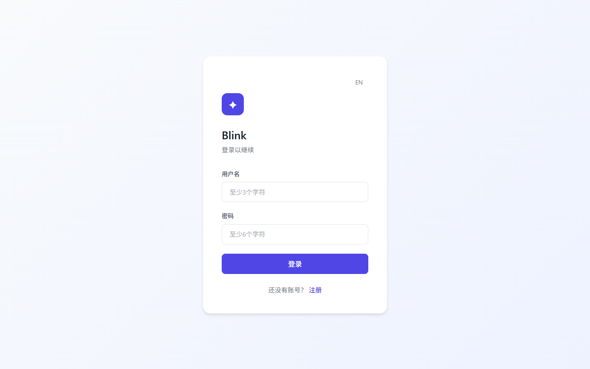
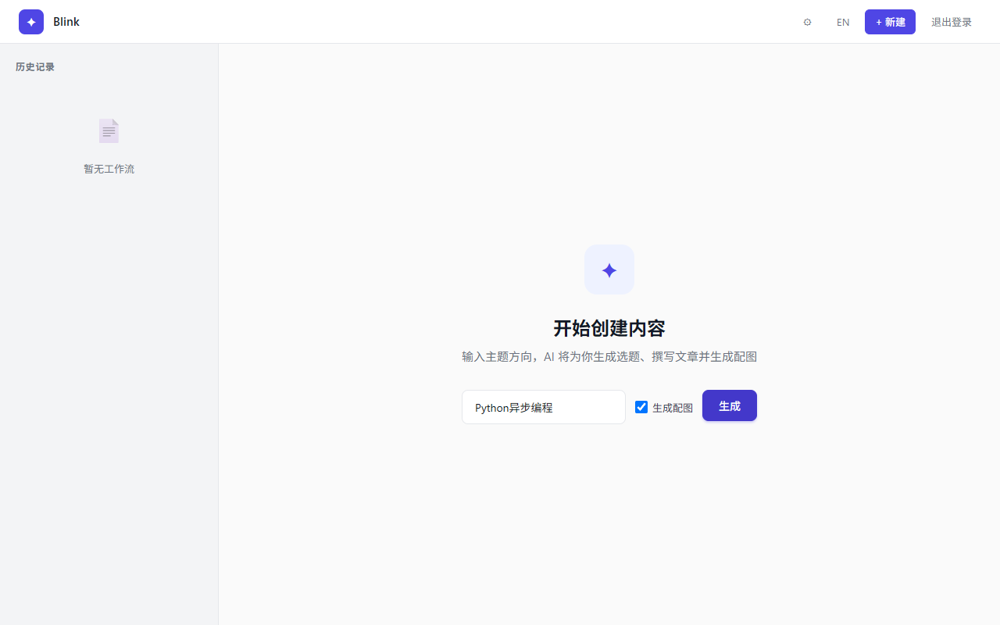
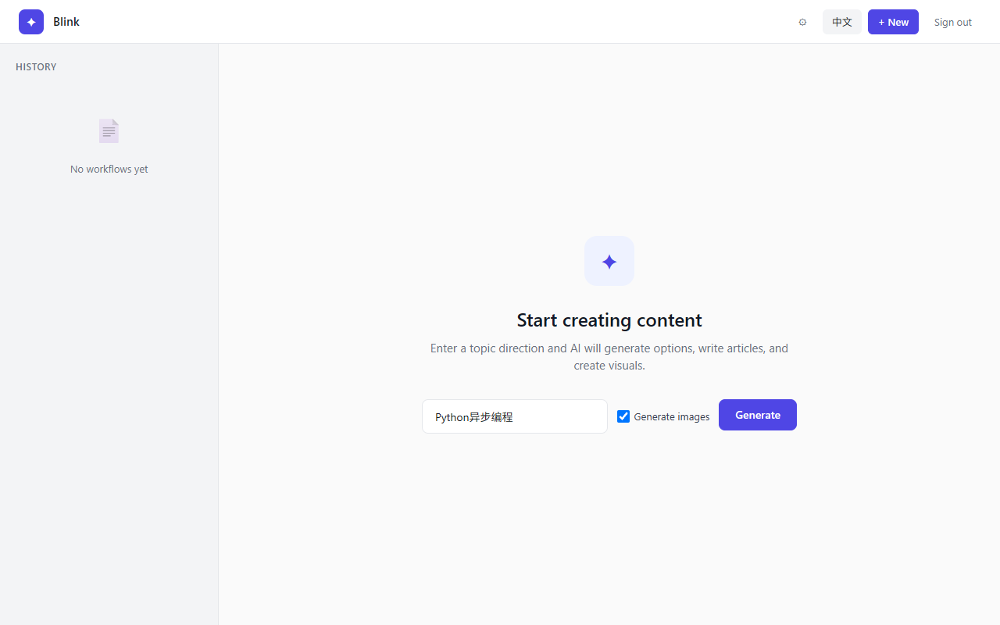
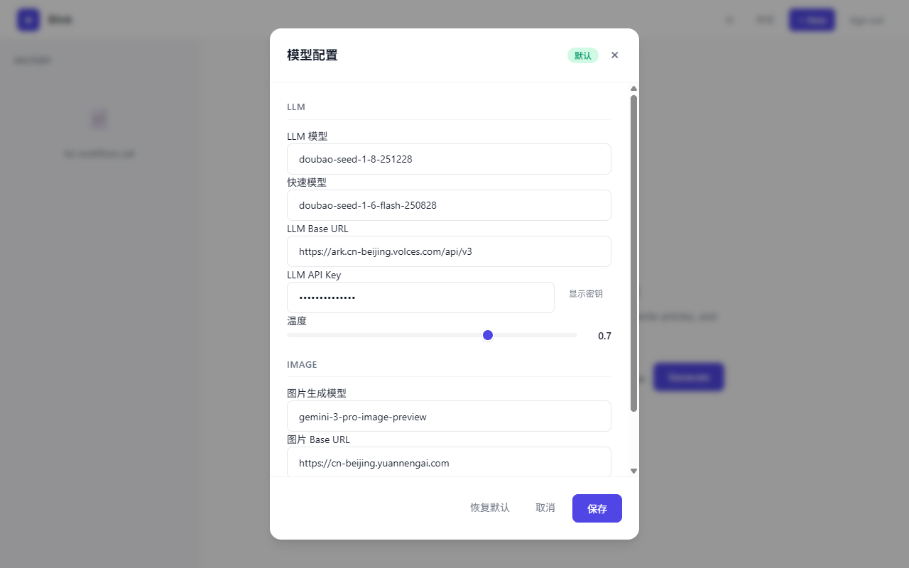
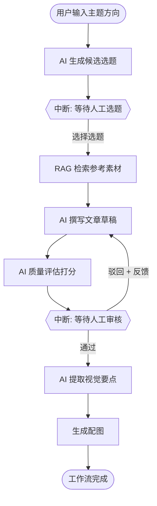
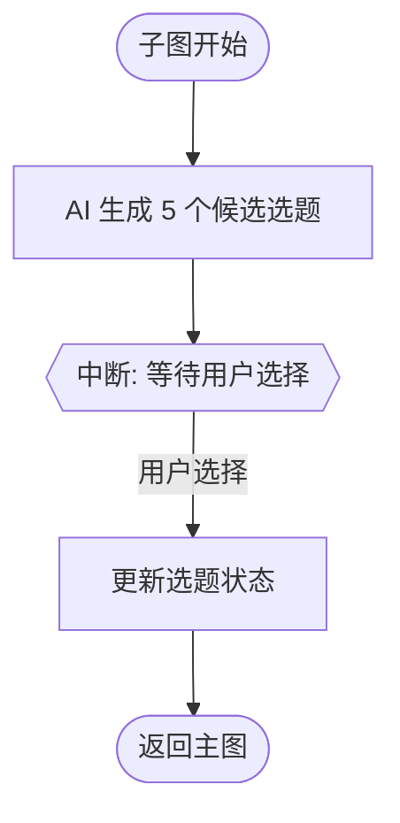

# <h1 align="center">Blink</h1>

> 基于 LangGraph 1.0+ 的人机协同内容生产系统

[English](README.md) | 中文


---

## 项目简介

Blink 是一个端到端的 AI 内容运营系统，在关键决策节点引入人工审核。工作流覆盖选题、写作、质量评估、配图生成全流程，通过 LangGraph 的 interrupt 机制在需要人类判断的环节暂停并等待输入。

**核心设计原则：** AI 负责执行（撰写、评分、生成图片），人类把控方向（选题决策）和质量（内容审核）。

### 核心功能

- **选题生成**：AI 根据主题方向生成多个候选选题，人工选择最佳方向
- **文章撰写**：AI 根据选定选题生成技术文章，支持 SSE 流式输出
- **质量评估**：AI 对文章进行多维度评分（相关性、可读性、深度）
- **人工审核**：支持通过/驳回机制，驳回后可携带反馈意见重写
- **配图生成**：自动提取视觉要点并生成小红书风格配图
- **RAG 检索**：基于 ChromaDB 的知识库检索增强，为写作提供参考素材
- **多语言支持**：中英文界面切换
- **桌面应用**：Electron 封装，支持一键启动后端与前端

---

## 界面预览

### 登录界面



### 主界面（中文）



### 主界面（英文）



### 模型配置



---

## 技术栈

| 层级 | 技术 |
|------|------|
| 后端框架 | FastAPI + Uvicorn (Python >= 3.10) |
| 工作流引擎 | LangGraph 1.0+ + LangChain 1.0+ |
| 数据库 | PostgreSQL 15 (SQLAlchemy AsyncIO + psycopg3) |
| 向量数据库 | ChromaDB (RAG 检索) |
| 前端框架 | Vue 3 + Vite 5 |
| 桌面封装 | Electron |
| LLM 服务 | 火山引擎 Doubao (标准模型 + 快速模型) |
| Embedding | SiliconFlow (BAAI/bge-m3) |
| 图片生成 | OpenAI 兼容图片生成 API (模型可配置) |
| 认证 | JWT (argon2 + bcrypt) |
| 日志 | structlog (支持 PII 脱敏) |
| 监控追踪 | LangSmith |

---

## 工作流程图



### 选题子图流程



---

## 目录结构

```
Blink/
├── app/                        # 后端应用
│   ├── api/v1/                 # API 路由 (auth, workflow, image, rag, config)
│   ├── core/                   # 核心模块 (config, db, security, logger, middleware)
│   ├── dependencies/           # 依赖注入 (auth)
│   ├── graph/                  # LangGraph 工作流
│   │   ├── nodes/              # 工作流节点 (planner, retriever, writer, evaluator, visualizer)
│   │   ├── subgraphs/          # 子图 (topic_selection)
│   │   ├── state.py            # 状态定义
│   │   └── workflow.py         # 工作流编排
│   ├── models/                 # 数据模型
│   ├── services/               # 服务层 (llm, image, rag)
│   └── main.py                 # FastAPI 入口
├── frontend/                   # 前端应用
│   ├── src/
│   │   ├── App.vue             # 主组件
│   │   ├── api.js              # API 封装
│   │   ├── composables/        # 组合式函数 (i18n, toast)
│   │   └── components/         # 组件
│   └── vite.config.js
├── electron/                   # Electron 桌面壳
│   ├── main.js                 # 主进程
│   ├── preload.js              # 预加载脚本
│   └── scripts/                # 启动脚本
├── tests/                      # 测试
│   ├── api/                    # API 集成测试
│   ├── unit/                   # 单元测试
│   ├── conftest.py             # pytest 配置
│   └── factories.py            # 测试工厂
├── scripts/
│   └── init_db.sql             # 数据库初始化脚本
├── static/                     # 静态文件
├── Dockerfile                  # Docker 构建文件
├── docker-compose.yml          # Docker Compose 编排
├── pyproject.toml              # Python 项目配置
└── .env.example                # 环境变量模板
```

---

## 快速开始

### 环境要求

- Python >= 3.10
- Node.js >= 20
- PostgreSQL 15+
- 以下 API Key（至少 LLM_API_KEY）：
  - 火山引擎 Doubao API Key
  - SiliconFlow API Key（RAG 功能需要）
  - 图片生成 API Key（配图功能需要，支持任意 OpenAI 兼容图片生成服务）

### 方式一：Docker Compose（推荐）

```bash
# 1. 克隆项目
git clone https://github.com/your-username/Blink.git
cd Blink

# 2. 复制环境变量模板并填写配置
cp .env.example .env
# 编辑 .env，至少填写 JWT_SECRET_KEY 和 LLM_API_KEY

# 3. 一键启动（PostgreSQL + 后端 + 前端构建）
docker compose up -d

# 4. 访问应用
# http://localhost:8000
```

### 方式二：本地开发

```bash
# 1. 克隆项目
git clone https://github.com/your-username/Blink.git
cd Blink

# 2. 配置环境变量
cp .env.example .env
# 编辑 .env，填写数据库连接、API Key、JWT_SECRET_KEY

# 3. 安装 Python 依赖（推荐使用虚拟环境）
python -m venv .venv
source .venv/bin/activate    # Linux/Mac
# .venv\Scripts\activate     # Windows
pip install -e ".[dev,rag]"

# 4. 初始化数据库
# 创建 PostgreSQL 数据库 aicontent，然后运行：
psql -h localhost -U postgres -d aicontent -f scripts/init_db.sql

# 5. 启动后端
python -m uvicorn app.main:app --host 127.0.0.1 --port 8080 --reload

# 6. 启动前端（新终端）
cd frontend
npm install
npm run dev
# 访问 http://localhost:5173
```

### 方式三：Electron 桌面应用

```bash
# 前置：完成本地开发中的步骤 2-4
# 然后安装 Electron 依赖
npm install

# 开发模式（同时启动后端 + 前端 + Electron）
npm run dev

# 打包构建
npm run build:win    # Windows
npm run build:mac    # macOS
npm run build:linux  # Linux
```

---

## 环境变量说明

| 变量名 | 说明 | 必填 |
|--------|------|------|
| `JWT_SECRET_KEY` | JWT 签名密钥，长度至少 32 字符 | 是 |
| `DATABASE_URL` | PostgreSQL 异步连接字符串 | 是 |
| `POSTGRES_URI` | PostgreSQL 同步连接字符串 (LangGraph Checkpointer) | 是 |
| `LLM_API_KEY` | 火山引擎 Doubao API Key | 是 |
| `LLM_BASE_URL` | LLM API 地址 | 否 |
| `LLM_MODEL` | 标准模型（文章写作） | 否 |
| `LLM_MODEL_FAST` | 快速模型（选题、提取） | 否 |
| `EMBEDDING_API_KEY` | SiliconFlow Embedding API Key | RAG 功能需要 |
| `IMAGE_API_KEY` | 图片生成 API Key | 配图功能需要 |
| `LANGCHAIN_API_KEY` | LangSmith API Key（追踪监控） | 否 |
| `CORS_ORIGINS` | 允许的前端来源 | 否 |

---

## 测试

```bash
# 运行全部测试
python -m pytest tests/ -v

# 运行单元测试
python -m pytest tests/unit/ -v

# 运行 API 测试
python -m pytest tests/api/ -v
```

当前共 67 个测试，覆盖 API 接口、工作流节点、安全模块、PII 脱敏等。

---

## API 文档

启动后端后访问 Swagger 文档：`http://localhost:8000/docs`

主要接口：

| 方法 | 路径 | 说明 |
|------|------|------|
| POST | `/api/v1/auth/register` | 用户注册 |
| POST | `/api/v1/auth/login` | 用户登录 |
| GET | `/api/v1/auth/me` | 获取当前用户 |
| POST | `/api/v1/workflow/start` | 启动工作流 |
| GET | `/api/v1/workflow/state/{thread_id}` | 获取工作流状态 |
| POST | `/api/v1/workflow/resume/{thread_id}` | 恢复工作流 |
| POST | `/api/v1/workflow/stream/resume/{thread_id}` | 流式恢复工作流 (SSE) |
| GET | `/api/v1/workflow/threads` | 获取线程列表 |
| DELETE | `/api/v1/workflow/threads/{thread_id}` | 删除线程 |
| POST | `/api/v1/rag/index` | 索引文档到知识库 |
| POST | `/api/v1/rag/retrieve` | 检索参考文档 |

---

## License

[MIT](LICENSE)
