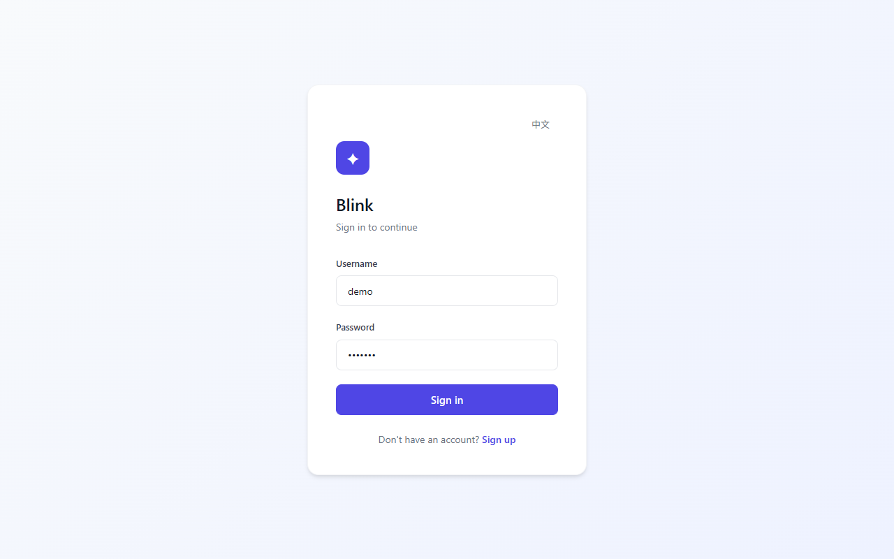

# Blink

> Human-in-the-loop content production system powered by LangGraph 1.0+

English | [中文](README.md)


---

## Overview

Blink is an end-to-end AI content operations system that introduces human review at critical decision points. The workflow covers topic selection, writing, quality evaluation, and image generation, using LangGraph's interrupt mechanism to pause and wait for input at stages requiring human judgment.

**Core Design Principle:** AI handles execution (writing, scoring, image generation), while humans control direction (topic selection) and quality (content review).

### Key Features

- **Topic Generation**: AI generates multiple candidate topics based on a theme direction; humans select the best direction
- **Article Writing**: AI generates technical articles based on the selected topic with SSE streaming output
- **Quality Evaluation**: AI scores articles across multiple dimensions (relevance, readability, depth)
- **Human Review**: Support for approve/reject mechanism with feedback-based rewriting
- **Image Generation**: Automatically extracts visual points and generates illustrations
- **RAG Retrieval**: ChromaDB-powered knowledge base retrieval for writing reference material
- **Multi-language**: Chinese/English interface toggle
- **Desktop App**: Electron wrapper for one-click backend and frontend launch

---

## Screenshots

### Login



### Main Dashboard (English)


### Main Dashboard (Chinese)


### Model Configuration


---

## Tech Stack

| Layer | Technology |
|-------|-----------|
| Backend Framework | FastAPI + Uvicorn (Python >= 3.10) |
| Workflow Engine | LangGraph 1.0+ + LangChain 1.0+ |
| Database | PostgreSQL 15 (SQLAlchemy AsyncIO + psycopg3) |
| Vector Database | ChromaDB (RAG retrieval) |
| Frontend Framework | Vue 3 + Vite 5 |
| Desktop Wrapper | Electron |
| LLM Service | Volcengine Doubao (standard model + fast model) |
| Embedding | SiliconFlow (BAAI/bge-m3) |
| Image Generation | OpenAI-compatible Image API (configurable model) |
| Authentication | JWT (argon2 + bcrypt) |
| Logging | structlog (with PII anonymization) |
| Tracing | LangSmith |

---

## Project Structure

```
Blink/
├── app/                        # Backend application
│   ├── api/v1/                 # API routes (auth, workflow, image, rag, config)
│   ├── core/                   # Core modules (config, db, security, logger, middleware)
│   ├── dependencies/           # Dependency injection (auth)
│   ├── graph/                  # LangGraph workflow
│   │   ├── nodes/              # Workflow nodes (planner, retriever, writer, evaluator, visualizer)
│   │   ├── subgraphs/          # Subgraphs (topic_selection)
│   │   ├── state.py            # State definition
│   │   └── workflow.py         # Workflow orchestration
│   ├── models/                 # Data models
│   ├── services/               # Service layer (llm, image, rag)
│   └── main.py                 # FastAPI entry point
├── frontend/                   # Frontend application
│   ├── src/
│   │   ├── App.vue             # Main component
│   │   ├── api.js              # API wrapper
│   │   ├── composables/        # Composables (i18n, toast)
│   │   └── components/         # Components
│   └── vite.config.js
├── electron/                   # Electron desktop shell
│   ├── main.js                 # Main process
│   ├── preload.js              # Preload script
│   └── scripts/                # Startup scripts
├── tests/                      # Tests
│   ├── api/                    # API integration tests
│   ├── unit/                   # Unit tests
│   ├── conftest.py             # pytest configuration
│   └── factories.py            # Test factories
├── scripts/
│   └── init_db.sql             # Database initialization script
├── static/                     # Static files
├── Dockerfile                  # Docker build file
├── docker-compose.yml          # Docker Compose orchestration
├── pyproject.toml              # Python project configuration
└── .env.example                # Environment variable template
```

---

## Quick Start

### Prerequisites

- Python >= 3.10
- Node.js >= 20
- PostgreSQL 15+
- The following API Keys (at least LLM_API_KEY):
  - Volcengine Doubao API Key
  - SiliconFlow API Key (required for RAG)
  - Image generation API Key (required for image generation, any OpenAI-compatible service)

### Option 1: Docker Compose (Recommended)

```bash
# 1. Clone the repository
git clone https://github.com/your-username/Blink.git
cd Blink

# 2. Copy environment template and fill in configuration
cp .env.example .env
# Edit .env, at minimum fill in JWT_SECRET_KEY and LLM_API_KEY

# 3. One-click start (PostgreSQL + Backend + Frontend build)
docker compose up -d

# 4. Access the application
# http://localhost:8000
```

### Option 2: Local Development

```bash
# 1. Clone the repository
git clone https://github.com/your-username/Blink.git
cd Blink

# 2. Configure environment variables
cp .env.example .env
# Edit .env, fill in database connection, API Key, JWT_SECRET_KEY

# 3. Install Python dependencies (virtual environment recommended)
python -m venv .venv
source .venv/bin/activate    # Linux/Mac
# .venv\Scripts\activate     # Windows
pip install -e ".[dev,rag]"

# 4. Initialize database
# Create PostgreSQL database aicontent, then run:
psql -h localhost -U postgres -d aicontent -f scripts/init_db.sql

# 5. Start backend
python -m uvicorn app.main:app --host 127.0.0.1 --port 8080 --reload

# 6. Start frontend (new terminal)
cd frontend
npm install
npm run dev
# Access http://localhost:5173
```

### Option 3: Electron Desktop App

```bash
# Prerequisite: Complete steps 2-4 from local development
# Then install Electron dependencies
npm install

# Development mode (starts backend + frontend + Electron)
npm run dev

# Build packages
npm run build:win    # Windows
npm run build:mac    # macOS
npm run build:linux  # Linux
```

---

## Environment Variables

| Variable | Description | Required |
|----------|-------------|----------|
| `JWT_SECRET_KEY` | JWT signing key, at least 32 characters | Yes |
| `DATABASE_URL` | PostgreSQL async connection string | Yes |
| `POSTGRES_URI` | PostgreSQL sync connection string (LangGraph Checkpointer) | Yes |
| `LLM_API_KEY` | Volcengine Doubao API Key | Yes |
| `LLM_BASE_URL` | LLM API endpoint | No |
| `LLM_MODEL` | Standard model (article writing) | No |
| `LLM_MODEL_FAST` | Fast model (topic generation, extraction) | No |
| `EMBEDDING_API_KEY` | SiliconFlow Embedding API Key | Required for RAG |
| `IMAGE_API_KEY` | Image generation API Key | Required for images |
| `LANGCHAIN_API_KEY` | LangSmith API Key (tracing) | No |
| `CORS_ORIGINS` | Allowed frontend origins | No |

---

## Testing

```bash
# Run all tests
python -m pytest tests/ -v

# Run unit tests
python -m pytest tests/unit/ -v

# Run API tests
python -m pytest tests/api/ -v
```

Currently 67 tests covering API endpoints, workflow nodes, security modules, PII anonymization, etc.

---

## API Documentation

After starting the backend, access Swagger docs at: `http://localhost:8000/docs`

Main endpoints:

| Method | Path | Description |
|--------|------|-------------|
| POST | `/api/v1/auth/register` | User registration |
| POST | `/api/v1/auth/login` | User login |
| GET | `/api/v1/auth/me` | Get current user |
| POST | `/api/v1/workflow/start` | Start workflow |
| GET | `/api/v1/workflow/state/{thread_id}` | Get workflow state |
| POST | `/api/v1/workflow/resume/{thread_id}` | Resume workflow |
| POST | `/api/v1/workflow/stream/resume/{thread_id}` | Stream resume workflow (SSE) |
| GET | `/api/v1/workflow/threads` | List threads |
| DELETE | `/api/v1/workflow/threads/{thread_id}` | Delete thread |
| POST | `/api/v1/rag/index` | Index document to knowledge base |
| POST | `/api/v1/rag/retrieve` | Retrieve reference documents |

---

## License

[MIT](LICENSE)
